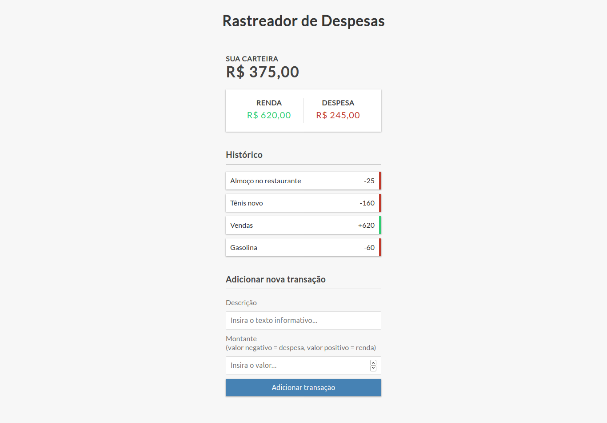

# expense-tracker-project

## Project

***EN:*** This is a useful project that helps in managing income and expenses. Add and remove items in the list with persistence in the Local Storage.

***PT-BR:*** Um projeto útil que ajuda no gerenciamento de rendas e despesas. Adicione e remova itens na lista com persistência no Local Storage.

### Specifications
- Create UI for project
- Display transaction items in DOM
- Show balance, expense and income totals
- Add new transation and reflect in total
- Delete items from DOM
- Persist to local storage
***

## Technologies

This project was developed with the following technologies:

- HTML
- CSS
- JavaScript
***
 
## Preview

***

## License

This project is under the MIT license.
